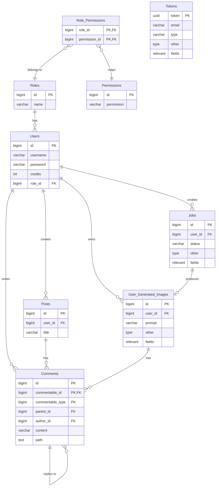

# PixGen
PixGen is a Spring Boot-based REST API that provides an AI-powered image generation platform built around asynchronous job processing and Java concurrency.

--- 

## Initial ERD

```mermaid
erDiagram

	Roles ||--o{ Users : "has"  
	Role_Permissions }o--|| Roles : "belongs to"  
	Role_Permissions }o--|| Permissions : "maps"    
	Users ||--o{ Jobs : "creates"  
	Users ||--o{ User_Generated_Images : "owns"  
	Users ||--o{ Posts : "creates"  
	Users ||--o{ Comments : "writes"  
	Jobs ||--o| User_Generated_Images : "produces"  
	Posts ||--o{ Comments : "has"  
	User_Generated_Images ||--o{ Comments : "has"  
	Comments ||--o{ Comments : "replies to"

Users {
	bigint id PK
	varchar username
	varchar password
	int credits
	bigint role_id FK
}

Jobs {
 bigint id PK
 bigint user_id FK
 varchar status
 type other relevant fields
}

User_Generated_Images {
	bigint id PK
	bigint user_id FK
	varchar prompt
	type other relevant fields
}

Posts {
	bigint id PK
	bigint user_id FK
	varchar title
}

Comments {
	bigint id PK
	bigint commentable_id PK,FK
	bigint commentable_type PK
	bigint parent_id FK
	bigint author_id FK
	varchar content
	text path
}

Tokens {
	uuid token PK
	varchar email
	varchar type
	type other relevant fields
}

Roles {
	bigint id PK
	varchar name
}

Permissions {
	bigint id PK
	varchar permission
}

Role_Permissions {
	bigint role_id PK,FK
	bigint permission_id PK,FK	
}
```