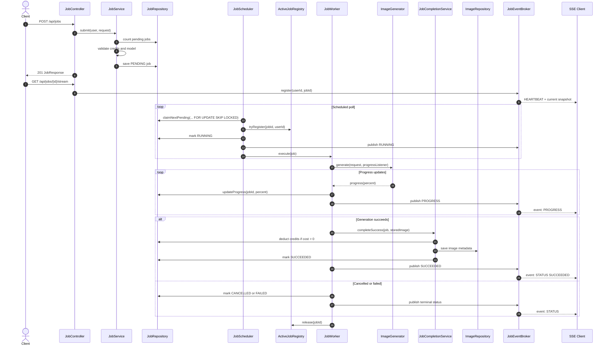
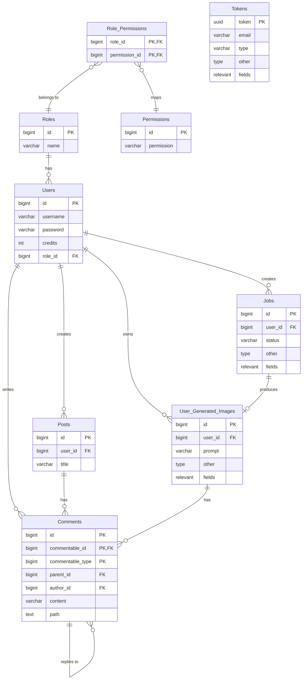

# PixGen
PixGen is a Spring Boot-based REST API that provides an AI-powered image generation platform built around asynchronous job processing and Java concurrency.

---

## Installation

### Prerequisites

- Java 17
- Maven 3.9+
- PostgreSQL 14+
- Optional: MailHog or another local SMTP server for verification and password reset email testing
- Optional: an internal image generation service compatible with the API documented in `drafts/internal-service-api-reference.json`

### Local Setup

1. Create a PostgreSQL database:

   ```bash
   createdb pixgen
   ```

2. Configure the local profile in `src/main/resources/application-dev.properties`:

   ```properties
   spring.datasource.url=jdbc:postgresql://localhost:5432/pixgen
   spring.datasource.username=postgres
   spring.datasource.password=12345678
   app.backend.base-url=http://localhost:8888
   app.frontend.base-url=localhost:3000
   ```

3. Choose the generation backend:

   ```properties
   # true: use the in-process simulated generator
   # false: call the configured internal image service
   app.internal-service-simulation=true
   app.internal-service.base-url=http://localhost:8000
   ```

4. Start the API:

   ```bash
   mvn spring-boot:run
   ```

5. Run tests:

   ```bash
   mvn test
   ```

The API runs on `http://localhost:8888` by default. The development seed creates the admin account configured by `seed.admin.email` and `seed.admin.password`.

## Job Architecture

Image generation is submitted as a job so HTTP requests stay short while generation runs asynchronously in the worker pool. The scheduler claims pending jobs with database locking, the worker streams progress through the in-process SSE broker, and successful completion persists both the generated image and the final job status in one transactional step.



## Trello Boards
- [Week #1](https://trello.com/b/q33CT7qR/ga-project-3-week-1-tasks)

## Initial ERD

