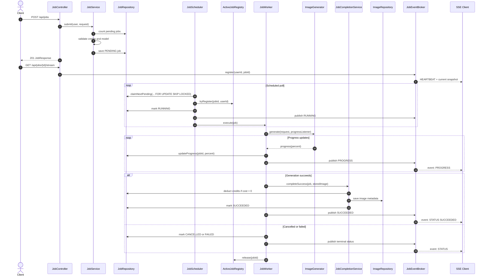

```mermaid
sequenceDiagram
    autonumber
    actor Client
    participant JobController
    participant JobService
    participant JobRepository
    participant JobScheduler
    participant ActiveJobRegistry
    participant JobWorker
    participant ImageGenerator
    participant JobCompletionService
    participant ImageRepository
    participant JobEventBroker
    participant SSE as SSE Client

    Client->>JobController: POST /api/jobs
    JobController->>JobService: submit(user, request)
    JobService->>JobRepository: count pending jobs
    JobService->>JobService: validate credits and model
    JobService->>JobRepository: save PENDING job
    JobController-->>Client: 201 JobResponse

    Client->>JobController: GET /api/jobs/{id}/stream
    JobController->>JobEventBroker: register(userId, jobId)
    JobEventBroker-->>SSE: HEARTBEAT + current snapshot

    loop Scheduled poll
        JobScheduler->>JobRepository: claimNextPending(... FOR UPDATE SKIP LOCKED)
        JobScheduler->>ActiveJobRegistry: tryRegister(jobId, userId)
        JobScheduler->>JobRepository: mark RUNNING
        JobScheduler->>JobEventBroker: publish RUNNING
        JobScheduler->>JobWorker: execute(job)
    end

    JobWorker->>ImageGenerator: generate(request, progressListener)
    loop Progress updates
        ImageGenerator-->>JobWorker: progress(percent)
        JobWorker->>JobRepository: updateProgress(jobId, percent)
        JobWorker->>JobEventBroker: publish PROGRESS
        JobEventBroker-->>SSE: event: PROGRESS
    end

    alt Generation succeeds
        JobWorker->>JobCompletionService: completeSuccess(job, storedImage)
        JobCompletionService->>JobRepository: deduct credits if cost > 0
        JobCompletionService->>ImageRepository: save image metadata
        JobCompletionService->>JobRepository: mark SUCCEEDED
        JobWorker->>JobEventBroker: publish SUCCEEDED
        JobEventBroker-->>SSE: event: STATUS SUCCEEDED
    else Cancelled or failed
        JobWorker->>JobRepository: mark CANCELLED or FAILED
        JobWorker->>JobEventBroker: publish terminal status
        JobEventBroker-->>SSE: event: STATUS
    end

    JobWorker->>ActiveJobRegistry: release(jobId)
```